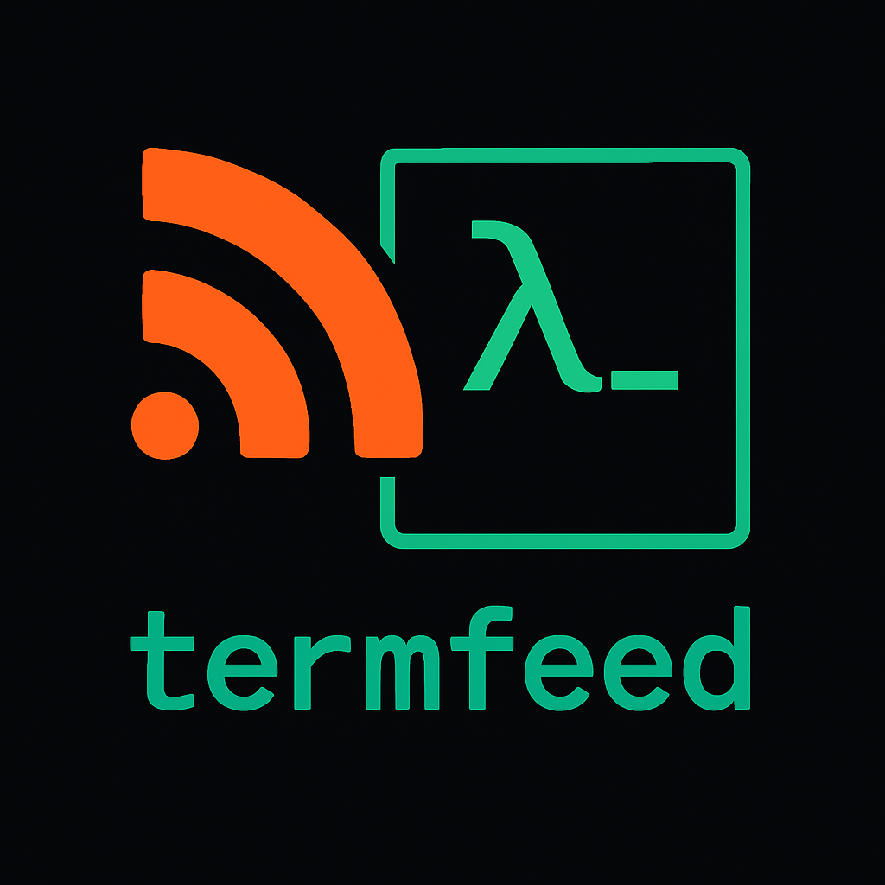

# termfeed

[](https://badge.fury.io/js/termfeed) [](https://opensource.org/licenses/MIT)

ターミナルで動作するモダンなRSSリーダー

<p align="center">
  
</p>

## 概要

termfeedは、ターミナル内で完全に動作するローカルRSSリーダーです。コマンドラインから離れることなく、高速でキーボード駆動のインターフェースでRSSフィードを管理・閲読できます。

## 主な機能

### 🎯 ターミナルUI（メイン機能）
- **2ペインレイアウト**: 左側フィード一覧（30%）、右側記事詳細（70%）
- **Vim風キーバインド**: `j`/`k`（記事移動）、`s`/`a`（フィード移動）、`v`（ブラウザ開く）
- **自動既読機能**: フィード移動時・アプリ終了時の自動既読化
- **未読記事フォーカス**: 未読記事のみナビゲーション、既読化で自動除外
- **ピン機能**: `p`キーで後で読む記事をマーク、`o`キーでまとめて開く（livedoor Reader風）
- **お気に入り連動**: `f`キーでお気に入り追加時に自動でピンも設定（v0.4.0〜）
- **お気に入り一覧**: `Shift+F`キーでお気に入り記事専用の1ペイン表示に切り替え
- **フィードレーティング**: `0`-`5`キーでフィードに重要度を設定、レーティング別セクション表示
- **インテリジェント表示**: 現在選択中のレーティングセクションのみ展開表示
- **ヘルプオーバーレイ**: `?`キーでキーボードショートカット一覧表示

### ⚙️ CLI管理機能
- コマンドラインからRSSフィードの追加・更新・削除
- 記事の既読管理、お気に入り機能
- バッチ処理による高速フィード更新
- **チュートリアルモード**: サンプルフィード付きでお試し可能

### 💾 データ管理
- ローカルSQLiteで記事、既読状態、お気に入りを管理
- 完全ローカル動作で外部サービスに依存しない設計

### 🤖 MCP（Model Context Protocol）対応
- Claude CodeなどのAIエージェントから記事データにアクセス可能
- RESTful APIではなくMCP経由でデータ提供
- リアルタイムな記事分析・要約が可能

## 技術スタック

- TypeScript
- Ink（ReactベースのターミナルUI）
- better-sqlite3（SQLiteデータベース）
- axios（HTTP通信）
- @modelcontextprotocol/sdk（MCP連携）

## インストール

### npxで実行（推奨）

```bash
# チュートリアルモードで試す（サンプルフィード付き）
npx termfeed tutorial

# 最新版を直接実行
npx termfeed tui

# 特定のコマンドを実行
npx termfeed add https://example.com/feed.rss
npx termfeed update
```

### npmでグローバルインストール

```bash
# グローバルにインストール
npm install -g termfeed

# 実行
termfeed tui
```

### ソースからビルド

```bash
# リポジトリのクローン
git clone https://github.com/syou6162/termfeed.git
cd termfeed

# 依存関係のインストール
npm install

# ビルド
npm run build

# グローバルにインストール（オプション）
npm link
```

## 使い方

### ターミナルUI（推奨）

#### 起動

```bash
# チュートリアルモードで試す（初回推奨）
termfeed tutorial

# TUIモードでRSSリーダーを起動
termfeed tui
```

#### チュートリアルモード

初めてtermfeedを使用する場合は、チュートリアルモードがおすすめです：

```bash
termfeed tutorial
```

- **サンプルフィード付き**: 4つの技術ブログフィードが自動登録済み
- **インメモリDB**: データは終了時に自動削除されるため、お試しに最適
- **即座に体験**: フィード登録の手間なく、すぐにtermfeedの機能を試せます

#### キーボード操作

| キー | 機能 |
|------|------|
| `j` / `↓` | 次の記事に移動（未読のみ） |
| `k` / `↑` | 前の記事に移動（未読のみ） |
| `s` | 次のフィードに移動 |
| `a` | 前のフィードに移動 |
| `v` | 選択記事をブラウザで開く（バックグラウンド） |
| `f` | お気に入り切り替え（自動でピンも設定） |
| `Shift+F` | お気に入り一覧表示に切り替え |
| `p` | ピン切り替え（後で読む記事をマーク） |
| `o` | ピンした記事を開く（最大10件ずつ、古い順） |
| `g` | 記事内の先頭へスクロール |
| `G` | 記事内の末尾へスクロール |
| `e` | エラー詳細表示トグル |
| `r` | 全フィードを更新 |
| `0`-`5` | フィードレーティング設定 |
| `?` | ヘルプ表示/非表示 |
| `q` | 終了 |
| `Ctrl+C` | 強制終了 |

#### 特徴

- **自動既読化**: フィード移動時（`s`/`a`）や終了時（`q`）に選択中の記事が自動的に既読になります
- **未読フォーカス**: `j`/`k`で移動できるのは未読記事のみ。既読になった記事は自動的にリストから除外されます
- **フィード優先表示**: 未読記事があるフィードが上位に表示され、効率的にチェックできます
- **バックグラウンドブラウザ**: `v`キーでブラウザを開いてもターミナルのフォーカスが維持されます
- **ピン機能**: `p`キーで記事をピン（後で読む）でき、`o`キーでピンした記事を最大10件ずつブラウザで開けます。古いピンから順に開かれ、開いた記事は自動的にピンが解除されます。複数回`o`キーを押すことで次の10件を開けます。一部のURLが開けなかった場合でも、成功したURLのピンは解除されます
- **お気に入りとピンの連動**: `f`キーでお気に入りに追加すると自動的にピンも設定されます。お気に入りを外すとピンも解除されます（v0.4.0〜）
- **お気に入り一覧表示**: `Shift+F`キーでお気に入り記事専用の1ペイン表示に切り替わります。記事のスクロール、ピン、お気に入り解除などの操作が可能です

### CLIコマンド（管理用）

#### はじめに

まずは**チュートリアルモード**で機能を体験してみてください：

```bash
termfeed tutorial
```

#### フィードの管理

```bash
# RSSフィードを追加
termfeed add <RSS_URL>

# 例：はてなブックマークの人気エントリーを追加
termfeed add https://b.hatena.ne.jp/hotentry.rss

# フィードを削除
termfeed rm <FEED_ID>

# フィード一覧を表示（ID付き、レーティング別セクション表示）
termfeed list

# フィード一覧をエクスポート形式で確認
termfeed export -  # 標準出力に表示
```

#### 記事の閲覧

**TUIモード（`termfeed tui`）を使用してください。**
TUIでは未読記事の閲覧、お気に入り管理、ブラウザで開く、フィードレーティングなどの機能がインタラクティブに利用できます。

##### フィードレーティング機能
- `0`-`5`キーでフィードに重要度を設定（0=評価なし、5=最高評価）
- フィードはレーティング別にセクション表示され、高評価順にソート
- 現在選択中のフィードが属するセクションのみ展開表示
- 未読記事数が各セクションに表示され、情報量を最適化

#### フィードの更新

フィードの更新は以下の方法で行えます：

- **TUIモード**: `termfeed tui` 起動後、`r`キーで全フィード更新
- **MCPサーバー**: `update_all_feeds` ツールを使用

TUIではリアルタイムで更新状況を確認でき、新着記事を即座に閲覧できます。


#### フィードのエクスポート/インポート

```bash
# フィードをOPML形式でエクスポート（デフォルト）
termfeed export
# -> subscriptions.opml に出力

# ファイル名を指定してエクスポート
termfeed export my-feeds.opml

# テキスト形式（1行1URL）でエクスポート
termfeed export feeds.txt --format text

# 拡張子から自動判別（.txt → テキスト形式）
termfeed export feeds.txt

# OPMLファイルからインポート
termfeed import subscriptions.opml

# テキストファイルからインポート（1行1URL）
termfeed import feeds.txt

# フォーマットを明示的に指定
termfeed import feeds.xml --format opml
```

**対応フォーマット：**
- **OPML形式**: 標準的なRSSリーダー間でのデータ移行に使用（.opml, .xml）
- **テキスト形式**: シンプルな1行1URLのフォーマット。コメント行（#で始まる）対応

### MCPサーバー（AIエージェント連携）

termfeedはMCP（Model Context Protocol）サーバーとして動作し、Claude CodeなどのAIエージェントから記事データにアクセスできます。

#### MCPサーバーの起動

```bash
# MCPサーバーとして起動（stdio通信）
termfeed mcp-server
```

#### Claude Codeでの使用方法

Claude CodeにMCPサーバーとして登録：

```bash
# 開発版を登録（リポジトリのパスを指定）
claude mcp add --scope user termfeed -- npx tsx /path/to/termfeed/src/index.ts mcp-server

# ビルド版/インストール版を登録
claude mcp add --scope user termfeed -- termfeed mcp-server
```

#### 利用可能なリソース

Claude Code内で以下のようにtermfeedのデータにアクセスできます：

**リソース（データ読み取り）:**
```
@termfeed:articles://unread          # 未読記事10件（デフォルト）
@termfeed:articles://favorites       # お気に入り記事10件
```

**ツール（操作実行）:**
- `update_all_feeds`: 全フィードを更新して新しい記事を取得
- `get_article`: 記事IDを指定して個別記事の詳細（全文）を取得

**ツール使用例:**
```
get_article(id: 123)  # 記事ID 123の詳細を取得
```

**注意:** 個別記事の取得は、Claude Codeでの発見性を向上させるため、リソースではなくツールとして実装されています。

#### 使用例

Claude Codeでの自然言語クエリ例：

- 「termfeedの未読記事を要約して」
- 「お気に入りの記事からトレンドを分析して」
- 「記事ID 456の内容を教えて」

#### MCPの利点

- **リアルタイム**: 最新の記事データに即座にアクセス
- **構造化**: JSON形式でメタデータも含む詳細情報
- **セキュア**: ローカル通信のみ、外部APIなし
- **効率的**: 必要なデータのみを動的に取得

### データベースの場所

SQLiteデータベースはデフォルトで `~/.local/share/termfeed/termfeed.db` に作成されます（XDG Base Directory準拠）。
環境変数 `TERMFEED_DB` で場所を変更できます：

```bash
export TERMFEED_DB=/path/to/your/termfeed.db
```

## ライセンス

MIT License - 詳細は[LICENSE](./LICENSE)を参照してください。
