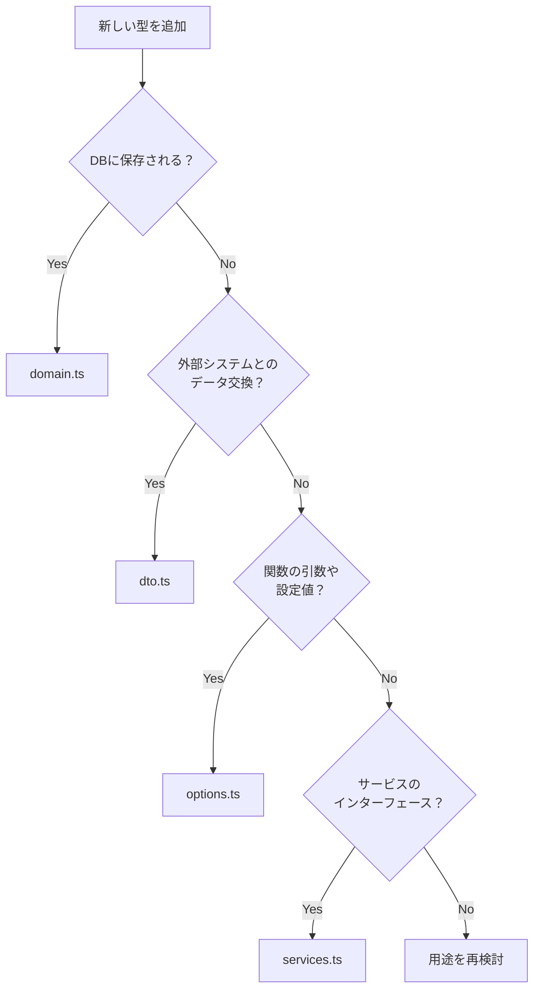

# 型定義ガイドライン

このドキュメントでは、termfeedプロジェクトにおける型定義の設計思想と使用方法について説明します。

## 目次

1. [型定義ファイルの役割分担](#型定義ファイルの役割分担)
2. [型配置の判断基準](#型配置の判断基準)
3. [具体例](#具体例)
4. [アンチパターンと注意点](#アンチパターンと注意点)
5. [設計思想](#設計思想)

## 型定義ファイルの役割分担

### domain.ts - ドメインモデル

**役割**: データベースに永続化されるエンティティの型定義

**含まれる型**:
- DBテーブルに対応するモデル（Feed, Article）
- DBへの入力型（CreateFeedInput, UpdateArticleInput）
- DBから取得した生データの型（ArticleRow）

**特徴**:
- 必須フィールドとオプショナルフィールドが明確
- 日付型はDateオブジェクトで統一
- IDは数値型で統一

```typescript
export type Article = {
  id: number;                  // 必須: 主キー
  feed_id: number;            // 必須: 外部キー
  title: string;              // 必須: タイトル
  content?: string;           // オプショナル: 本文
  created_at: Date;           // 必須: タイムスタンプ
  updated_at: Date;           // 必須: タイムスタンプ
};
```

### dto.ts - データ転送オブジェクト

**役割**: 外部システムとのデータ交換、処理結果の型定義

**含まれる型**:
- 外部API（RSS）のレスポンス（RSSItem, RSSFeed）
- 処理結果の型（CrawlResult, FeedUpdateResult）
- 複雑な操作の結果（AddFeedResult, UpdateAllFeedsResult）

**特徴**:
- 外部仕様に依存する型定義
- 多くのフィールドがオプショナル（外部データの不確実性）
- ドメインモデルへの変換が前提

```typescript
export type RSSItem = {
  title?: string;         // RSS仕様では必須でない
  link?: string;          // RSS仕様では必須でない
  pubDate?: string;       // 文字列形式の日付
  // ...外部仕様に準拠
};
```

### options.ts - オプション型

**役割**: 関数の引数、クエリパラメータ、設定値の型定義

**含まれる型**:
- クエリオプション（ArticleQueryOptions）
- 設定オプション（CrawlerOptions）
- エラー型（ServiceError）
- 状態を表す共用体型（FeedUpdateSuccess, FeedUpdateFailure）

**特徴**:
- ほとんどのフィールドがオプショナル
- 実行時の動的な条件を表現
- 判別共用体によるパターンマッチング

```typescript
export type ArticleQueryOptions = {
  feedId?: number;      // フィルタ条件（任意）
  isRead?: boolean;     // フィルタ条件（任意）
  limit?: number;       // ページネーション（任意）
  offset?: number;      // ページネーション（任意）
};
```

### services.ts - サービスインターフェース

**役割**: ビジネスロジック層の契約定義

**含まれる型**:
- サービスクラスのインターフェース（FeedService, ArticleService）
- 外部連携サービスの型（RSSCrawler）

**特徴**:
- メソッドシグネチャの定義
- 実装クラスが満たすべき契約
- 依存性注入のための型

```typescript
export type ArticleService = {
  getArticles(options?: ArticleQueryOptions): Article[];
  markAsRead(articleId: number): boolean;
  // ...ビジネスロジックの契約
};
```

## 型配置の判断基準

新しい型をどのファイルに配置するか迷った場合は、以下の質問に答えてください：

### フローチャート



### 判断の質問リスト

1. **この型はDBに永続化されるか？**
   - Yes → `domain.ts`
   - No → 次の質問へ

2. **この型は外部システムから受け取る、または送信するデータか？**
   - Yes → `dto.ts`
   - No → 次の質問へ

3. **この型は関数の引数、戻り値、または設定を表すか？**
   - Yes → `options.ts`
   - No → 次の質問へ

4. **この型はサービス層のメソッドを定義するか？**
   - Yes → `services.ts`
   - No → 設計を見直す

## 具体例

### 例1: RSSフィードの統計情報を追加する場合

**要件**: 各フィードの記事数、未読数、最終更新日時などの統計情報を表示したい

**判断プロセス**:
1. DBに保存される？ → No（動的に計算される）
2. 外部システムとのデータ交換？ → No
3. 関数の戻り値？ → Yes（統計情報を返す関数の戻り値）

**結論**: `options.ts`に配置

```typescript
// options.ts
export type FeedStatistics = {
  feedId: number;
  totalArticles: number;
  unreadArticles: number;
  lastUpdated: Date;
};
```

### 例2: お気に入り記事のエクスポート機能

**要件**: お気に入り記事をJSON形式でエクスポートする

**判断プロセス**:
1. DBに保存される？ → No
2. 外部システムに送信するデータ？ → Yes（ファイルとして出力）

**結論**: `dto.ts`に配置

```typescript
// dto.ts
export type ExportedArticle = {
  title: string;
  url: string;
  savedAt: string;  // ISO形式の文字列
  tags?: string[];
};

export type ExportResult = {
  articles: ExportedArticle[];
  exportedAt: string;
  version: string;
};
```

### 例3: ユーザー設定機能の追加

**要件**: 更新間隔、表示件数などのユーザー設定を保存

**判断プロセス**:
1. DBに保存される？ → Yes

**結論**: `domain.ts`に配置

```typescript
// domain.ts
export type UserSettings = {
  id: number;
  update_interval: number;  // 分単位
  articles_per_page: number;
  theme: 'light' | 'dark';
  created_at: Date;
  updated_at: Date;
};
```

## アンチパターンと注意点

### ❌ アンチパターン1: UI層専用の型をdomain.tsに置く

```typescript
// 悪い例：domain.ts
export type ArticleListItem = {
  id: number;
  title: string;
  isSelected: boolean;  // UI状態！
  isHovered: boolean;   // UI状態！
};
```

**理由**: UI状態はドメインモデルではない

**正しい方法**: UIコンポーネント内で定義するか、別途ui-types.tsを作成

### ❌ アンチパターン2: 一時的なデータ構造をdomain.tsに置く

```typescript
// 悪い例：domain.ts
export type TempImportData = {
  feedUrl: string;
  articles: string[];
  status: 'pending' | 'processing' | 'done';
};
```

**理由**: 永続化されない一時データはドメインモデルではない

**正しい方法**: `options.ts`または処理を行うモジュール内で定義

### ❌ アンチパターン3: 巨大な型定義

```typescript
// 悪い例：1つの型に責務が多すぎる
export type SuperArticle = {
  // ドメインモデル
  id: number;
  title: string;
  // UI状態
  isSelected: boolean;
  // 統計情報
  viewCount: number;
  // 処理状態
  isSyncing: boolean;
};
```

**正しい方法**: 責務ごとに型を分離

```typescript
// domain.ts
export type Article = { id: number; title: string; };

// options.ts
export type ArticleStats = { viewCount: number; };
export type ArticleSyncState = { isSyncing: boolean; };
```

### どのファイルにも当てはまらない型の扱い方

1. **まず設計を見直す**: 本当に必要な型か？既存の型で表現できないか？

2. **用途が限定的な場合**: 使用する場所の近くで定義
   ```typescript
   // src/utils/helpers.ts
   type LocalHelperType = { ... };  // このファイル内でのみ使用
   ```

3. **複数箇所で使用するが既存分類に合わない場合**: 
   - 新しいカテゴリーファイルの作成を検討（例: `common.ts`）
   - チームで議論して方針を決定

## 設計思想

### なぜinterfaceではなくtypeを選択したか

1. **一貫性**: すべての型定義を`type`で統一することで学習コストを削減

2. **柔軟性**: `type`の方が表現力が高い
   ```typescript
   // ユニオン型
   type Status = 'active' | 'inactive';
   
   // インターセクション型
   type TimestampedArticle = Article & { viewedAt: Date };
   
   // 条件型
   type Nullable<T> = T | null;
   ```

3. **最新機能との親和性**: TypeScript 4.9以降の`satisfies`演算子との相性
   ```typescript
   const feedService = {
     async addFeed(url: string) { /* ... */ }
   } satisfies FeedService;
   ```

### 型定義をsrc/types/に集約した理由

1. **単一責任の原則**: 型定義の管理を一元化

2. **循環参照の防止**: 明確な依存関係の方向性
   ```
   models/ → types/ ← services/
   ```

3. **検索性の向上**: 型定義の場所が予測可能

4. **リファクタリングの容易さ**: 型定義の変更が局所化

### import時の@/typesパスエイリアスの活用方法

1. **推奨される書き方**:
   ```typescript
   import type { Feed, Article } from '@/types';
   ```

2. **型のみのインポート**: `import type`を使用してバンドルサイズを最適化
   ```typescript
   import type { FeedService } from '@/types';  // 良い
   import { FeedService } from '@/types';       // 避ける
   ```

3. **エディタサポート**: VSCodeなどのエディタで自動補完が効く

4. **相対パスの問題を回避**:
   ```typescript
   // 悪い例（相対パスは階層が深くなると複雑）
   import type { Feed } from '../../../types/domain';
   
   // 良い例（常に同じパス）
   import type { Feed } from '@/types';
   ```

## まとめ

型定義の適切な配置は、コードの保守性と可読性に大きく影響します。このガイドラインに従うことで：

- 新しい開発者がプロジェクトを理解しやすくなる
- 型定義の重複や不整合を防げる
- リファクタリングが容易になる
- TypeScriptの型システムを最大限活用できる

迷った時は、このドキュメントを参照するか、既存のコードパターンを参考にしてください。